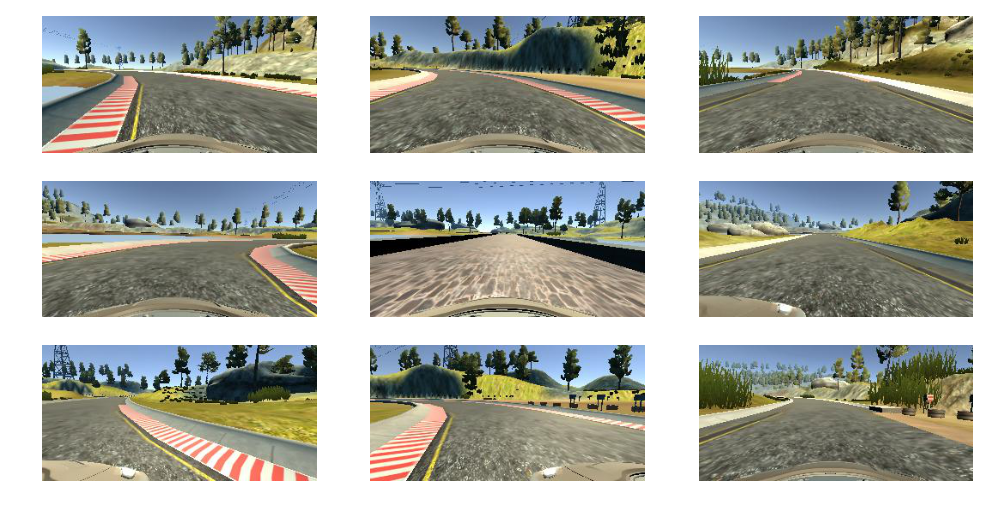
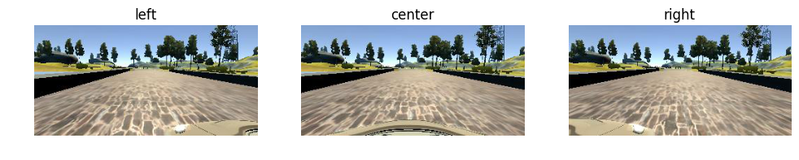
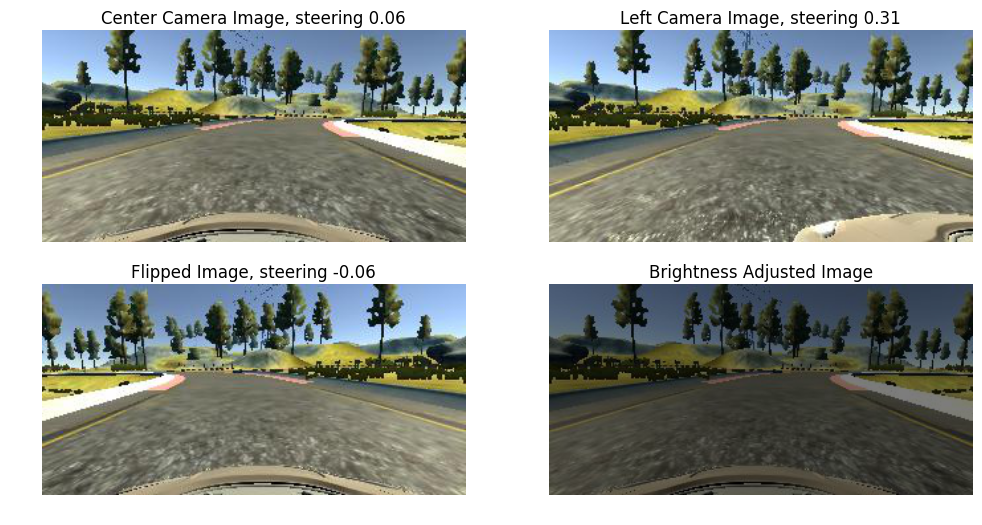

# About this project
This repository contains code for a project I did as a part of [Udacity's Self Driving Car Nano Degree Program](https://www.udacity.com/drive). We had to train a car to drive itself in a video game. The car was trained to drive itself using a deep neural network. Scroll down to see the demo video.

# Exploring the Dataset
I used the dataset provided by Udacity. About 8000 images. I did not record images myself.

The dataset contains JPG images of dimensions 160x320x3. Here are some sample images from the dataset.

## Unbalanced Data
Most of the steering angles are close to zero, on the negative side. There is a bias towards driving straight and turning left.

## Left/Right Camera ~= Parallel Transformation of the car
The left and right cameras point straight, along the length of the car. So the left and right camera are like parallel transformations of the car.

# Augmentation Techniques Used

I have to thank this [NVIDEA paper](http://images.nvidia.com/content/tegra/automotive/images/2016/solutions/pdf/end-to-end-dl-using-px.pdf) and [this blog post](https://chatbotslife.com/using-augmentation-to-mimic-human-driving-496b569760a9#.d779iwp28) for suggesting these techniques.

## Use left & right camera images to simulate recovery
Using left and right camera images to simulate the effect of car wandering off to the side, and recovering. We will add a small angle .25 to the left camera and subtract a small angle of 0.25 from the right camera. The main idea being the left camera has to move right to get to center, and right camera has to move left.

## Flip the images horizontally
Since the dataset has a lot more images with the car turning left than right(because there are more left turns in the track), you can flip the image horizontally to simulate turing right and also reverse the corressponding steering angle.

## Brightness Adjustment
In this you adjust the brightness of the image to simulate driving in different lighting conditions

With these augmentation techniques, you can practically generate infinite unique images for training your neural network.

# Preproceesing Images
1. I noticed that the hood of the car is visible in the lower portion of the image. We can remove this.
2. Also the portion above the horizon (where the road ends) can also be ignored.

After trial and error I figured out that shaving 55 pixels from the top and 25 pixels from the bottom works well.

Finally the image is resized to 64x64. Here is how a sample image could look like:

## Data Generation Techniques Used
Data is augmented and generated on the fly using python generators. So for every epoch, the optimizer practically sees a new and augmented data set.

## Model Architecture

1. **Layer 1**: Conv layer with 32 5x5 filters, followed by ELU activation
2. **Layer 2**: Conv layer with 16 3x3 filters, ELU activation, Dropout(0.4) and 2x2 max pool
3. **Layer 3**: Conv layer with 16 3x3 filters, ELU activation, Dropout(0.4)
4. **Layer 4**: Fully connected layer with 1024 neurons, Dropout(0.3) and ELU activation
5. **Layer 5**: Fully connected layer with 1024 neurons, Dropout(0.3) and ELU activation

## Training Method

1. Optimizer: Adam Optimizer
2. No. of epochs: 3
3. Images generated per epoch: 20,000 images generated on the fly
3. Validation Set: 3000 images, generated on the fly
4. No test set used, since the success of the model is evaluated by how well it drives on the road and not by test set loss
5. Keras' `fit_generator` method is used to train images generated by the generator

## Evaluation Video

Click on the image to watch the video or [click here](https://youtu.be/kElUwEoZ7P0). You will be redirected to YouTube.

